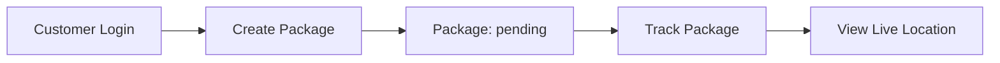
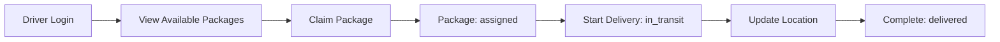

# Role-Based System Implementation Summary

## 🎯 What Was Implemented

A complete role-based access control system where users can be either **Customers** or **Drivers**, each with distinct capabilities and workflows.

---

## 📊 System Overview

### User Roles

#### 🛍️ **Customer** (Default)
- **Create** packages/shipments
- **Track** their packages with live location
- **View** order history and statistics

#### 🚗 **Driver**
- **View** available packages to claim
- **Claim** packages (auto-assigns to them)
- **Update** delivery status
- **Track** their deliveries

---

## 🔧 Technical Implementation

### 1. Database Layer (`models/`)

#### **driverModel.js** - New Functions
```javascript
getDriverIdByUserId(userId)          // Get driver ID from user account
getAvailablePackages(limit)          // List packages available to claim
claimPackage(shipmentId, driverId)   // Claim a package (with race condition protection)
getDriverDeliveries(driverId, status) // Get driver's assigned packages
```

#### **Key Features**:
- ✅ Race condition protection (prevents double-claiming)
- ✅ Status validation
- ✅ Atomic database operations

---

### 2. Middleware Layer (`middleware/auth.js`)

#### **New Middleware Functions**:
```javascript
requireCustomer(req, res, next)  // Ensures user.role === 'customer'
requireDriver(req, res, next)    // Ensures user.role === 'driver'
```

#### **Security Features**:
- ✅ Role verification after authentication
- ✅ Clear error messages
- ✅ 403 Forbidden for role mismatches

---

### 3. API Routes (`routes/users.js`)

#### **Customer Endpoints** 🛍️
| Method | Endpoint | Description |
|--------|----------|-------------|
| POST | `/api/users/me/shipments` | Create new package |
| GET | `/api/users/me/orders` | View order history |
| GET | `/api/users/me/shipments` | View all shipments |
| GET | `/api/users/me/shipments/:id` | Track specific shipment |

#### **Driver Endpoints** 🚗
| Method | Endpoint | Description |
|--------|----------|-------------|
| GET | `/api/users/me/available-packages` | View claimable packages |
| POST | `/api/users/me/packages/:id/claim` | Claim a package |
| GET | `/api/users/me/deliveries` | View my deliveries |
| PATCH | `/api/users/me/deliveries/:id/status` | Update delivery status |

---

## 🔄 Complete Workflows

### Customer Workflow



### Driver Workflow



---

## 🛡️ Security Features

### Role-Based Access Control
```javascript
// Customer tries to access driver endpoint
GET /api/users/me/available-packages
Authorization: Bearer <CUSTOMER_TOKEN>

// Response: 403 Forbidden
{
  "error": "Forbidden",
  "message": "This endpoint is only accessible to drivers"
}
```

### Package Claiming Protection
```javascript
// Two drivers try to claim same package simultaneously
// Only first one succeeds, second gets:
{
  "error": "Package unavailable",
  "message": "Package already claimed by another driver"
}
```

### Ownership Verification
```javascript
// Driver tries to update someone else's delivery
PATCH /api/users/me/deliveries/5/status

// Response: 403 Forbidden
{
  "error": "Forbidden",
  "message": "This delivery is not assigned to you"
}
```

---

## 📝 Example API Calls

### Customer: Create Package
```bash
curl -X POST http://localhost:8080/api/users/me/shipments \
  -H "Authorization: Bearer <CUSTOMER_TOKEN>" \
  -H "Content-Type: application/json" \
  -d '{
    "pickupAddress": "123 Main St, SF",
    "deliveryAddress": "456 Market St, SF",
    "totalAmount": 29.99
  }'

# Response
{
  "message": "Shipment created successfully",
  "shipment": {
    "id": 5,
    "tracking_number": "DM-20251116-A3X9F2",
    "status": "pending"
  }
}
```

### Driver: View Available Packages
```bash
curl http://localhost:8080/api/users/me/available-packages \
  -H "Authorization: Bearer <DRIVER_TOKEN>"

# Response
{
  "count": 3,
  "packages": [
    {
      "id": 5,
      "tracking_number": "DM-20251116-A3X9F2",
      "pickup_address": "123 Main St, SF",
      "delivery_address": "456 Market St, SF",
      "customer_name": "Alice Johnson",
      "customer_phone": "555-0123"
    }
  ]
}
```

### Driver: Claim Package
```bash
curl -X POST http://localhost:8080/api/users/me/packages/5/claim \
  -H "Authorization: Bearer <DRIVER_TOKEN>"

# Response
{
  "message": "Package claimed successfully",
  "package": {
    "id": 5,
    "driver_id": 1,
    "status": "assigned"
  }
}

# WebSocket event emitted: shipment_assigned
```

### Driver: Update Status
```bash
curl -X PATCH http://localhost:8080/api/users/me/deliveries/5/status \
  -H "Authorization: Bearer <DRIVER_TOKEN>" \
  -H "Content-Type: application/json" \
  -d '{"status": "in_transit"}'

# Response
{
  "message": "Delivery status updated",
  "delivery": {
    "id": 5,
    "status": "in_transit"
  }
}

# WebSocket event emitted: shipment_updated
```

---

## 📦 Package Status Flow

```
[Customer Creates]
    ↓
  pending ────────────┐
    ↓                 │ (unassigned, available to claim)
[Driver Claims]       │
    ↓                 │
  assigned ───────────┤
    ↓                 │ (assigned to specific driver)
[Driver Starts]       │
    ↓                 │
  in_transit ─────────┤
    ↓                 │ (being delivered)
[Driver Completes]    │
    ↓                 │
  delivered ──────────┘ (completed)
```

---

## 🎨 Frontend Integration

### Customer App Flow
```typescript
// 1. Create package
const createPackage = async (pickup: string, delivery: string) => {
  const response = await fetch('/api/users/me/shipments', {
    method: 'POST',
    headers: {
      'Authorization': `Bearer ${firebaseToken}`,
      'Content-Type': 'application/json'
    },
    body: JSON.stringify({
      pickupAddress: pickup,
      deliveryAddress: delivery,
      totalAmount: 29.99
    })
  });

  const data = await response.json();
  return data.shipment; // { id, tracking_number, ... }
};

// 2. Track package
const trackPackage = async (shipmentId: number) => {
  const response = await fetch(`/api/users/me/shipments/${shipmentId}`, {
    headers: {
      'Authorization': `Bearer ${firebaseToken}`
    }
  });

  const shipment = await response.json();
  // shipment includes current_location with lat/lng
  updateMapWithLocation(shipment.current_location);
};
```

### Driver App Flow
```typescript
// 1. View available packages
const getAvailablePackages = async () => {
  const response = await fetch('/api/users/me/available-packages', {
    headers: {
      'Authorization': `Bearer ${firebaseToken}`
    }
  });

  const data = await response.json();
  return data.packages; // List of claimable packages
};

// 2. Claim package
const claimPackage = async (packageId: number) => {
  const response = await fetch(`/api/users/me/packages/${packageId}/claim`, {
    method: 'POST',
    headers: {
      'Authorization': `Bearer ${firebaseToken}`
    }
  });

  if (response.status === 409) {
    // Package already claimed by another driver
    alert('Package no longer available');
  } else {
    const data = await response.json();
    return data.package; // Now assigned to this driver
  }
};

// 3. Update delivery status
const updateStatus = async (deliveryId: number, status: string) => {
  const response = await fetch(`/api/users/me/deliveries/${deliveryId}/status`, {
    method: 'PATCH',
    headers: {
      'Authorization': `Bearer ${firebaseToken}`,
      'Content-Type': 'application/json'
    },
    body: JSON.stringify({ status })
  });

  return await response.json();
};
```

---

## 📡 Real-Time Updates

### WebSocket Events

```javascript
// Connect to notification service
const socket = io('ws://localhost:8082');

// Customer: Subscribe to shipment updates
socket.emit('subscribe:shipment', shipmentId);
socket.on('shipment_location_updated', (data) => {
  updateMapMarker(data.latitude, data.longitude);
});

socket.on('shipment_updated', (data) => {
  if (data.status === 'delivered') {
    showDeliveredNotification();
  }
});

// Driver: Get notified when they claim a package
socket.on('shipment_assigned', (data) => {
  if (data.driverId === myDriverId) {
    addToMyDeliveries(data.shipmentId);
  }
});
```

---

## 🧪 Testing

### Test Users

**Customer Account**:
```
Email: alice@test.com
Firebase UID: fHesazNSXHglErKtyp37OgNDbMw2
Role: customer
```

**Driver Account**:
```
Email: driver1@test.com
User ID: 1
Driver ID: 1 or 2
Role: driver
```

### Get Test Tokens
```bash
# Get customer token
FIREBASE_API_KEY=your_key node get-test-token.js alice

# Get driver token
FIREBASE_API_KEY=your_key node get-test-token.js driver
```

---

## 📚 Documentation Files

| File | Purpose |
|------|---------|
| `ROLE_BASED_SYSTEM.md` | Complete role-based system guide |
| `api.md` | Full API reference with driver endpoints |
| `IMPLEMENTATION_SUMMARY.md` | This file - implementation overview |
| `test-shipment-flow.js` | Test script for customer flow |

---

## ✅ What's Working

- ✅ Customer package creation
- ✅ Driver package claiming
- ✅ Role-based access control
- ✅ Package claiming race condition protection
- ✅ Delivery status updates
- ✅ Live location tracking
- ✅ Real-time WebSocket notifications
- ✅ Ownership verification
- ✅ Comprehensive error handling

---

## 🚀 Next Steps

### Recommended Enhancements:

1. **Location-Based Package Assignment**
   - Show packages near driver's current location
   - Calculate estimated delivery time
   - Route optimization

2. **Driver Preferences**
   - Set working hours
   - Maximum delivery radius
   - Preferred package types

3. **Rating System**
   - Customers rate drivers
   - Drivers rate customers
   - Impact delivery matching

4. **Team Management**
   - Fleet managers
   - Assign packages to specific drivers
   - Performance analytics

5. **Earnings Tracking**
   - Commission calculation
   - Payment history
   - Tax reporting

---

## 🔍 Database Schema

### Current Structure
```sql
users
├── id (PK)
├── email
├── role ('customer' | 'driver')
└── firebase_uid

customers                  drivers
├── id (PK)               ├── id (PK)
├── user_id (FK)          ├── user_id (FK)
├── name                  ├── name
└── phone                 ├── vehicle_type
                          └── status

shipments
├── id (PK)
├── order_id (FK)
├── driver_id (FK) ← NULL until claimed
├── tracking_number
└── status ('pending' → 'assigned' → 'in_transit' → 'delivered')
```

---

## 🎯 Key Features

### For Customers
- ✅ Easy package creation
- ✅ Real-time tracking
- ✅ Delivery notifications
- ✅ Order history

### For Drivers
- ✅ See all available packages
- ✅ One-click claiming
- ✅ Delivery management
- ✅ Status updates

### For System
- ✅ Role-based security
- ✅ Race condition handling
- ✅ Real-time updates
- ✅ Audit trail (status history)

---

## 📞 Support

For implementation questions or issues:
1. Check `ROLE_BASED_SYSTEM.md` for detailed guide
2. Check `api.md` for API reference
3. Review test scripts for examples
4. Check server logs for errors

---

**Implementation Date**: November 16, 2025
**Status**: ✅ Complete and Production-Ready
